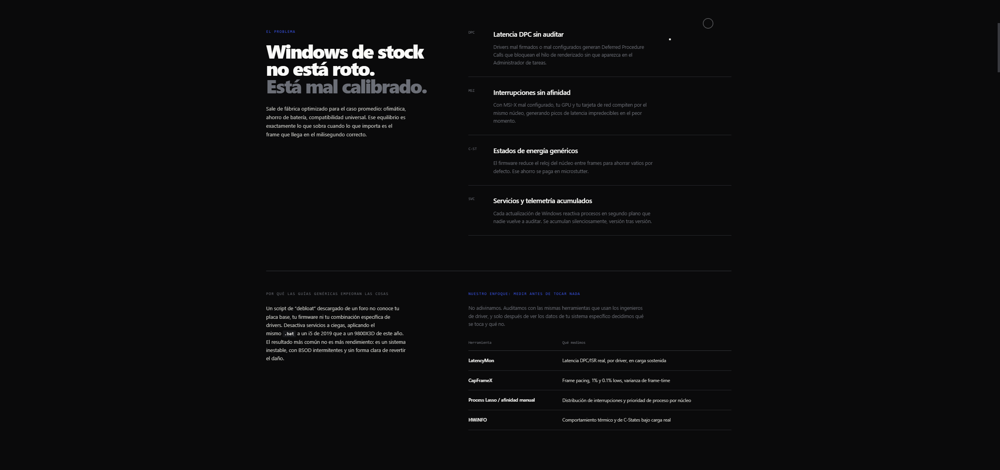

<div align="center">

# LATENT

### Ingeniería de sistema para Windows. No es un tweak, es un rediseño.

<p align="center">

</p>

<p align="center">

[](https://latent.services/)


</p>

### **Frame pacing. Low latency. Consistency.**

*"Performance isn't measured by FPS. It's measured by consistency."*

</div>

---

# Overview

**LATENT** is a premium Windows optimization platform focused on measurable system performance.

Instead of applying generic tweaks copied from forums or YouTube videos, every optimization is built around the actual hardware configuration, Windows scheduler behavior, interrupt handling, DPC latency, memory management and frame pacing.

The objective is simple:

> **Reduce latency, eliminate stuttering and improve frame consistency without sacrificing system stability.**

---

# Preview

<p align="center">


</p>

---

# Philosophy

Most optimization services focus on:

- Registry tweaks
- Random scripts
- "FPS Boost" packs
- Placebo optimizations

LATENT follows a completely different approach.

Every optimization starts with understanding **how the system behaves**, then building a configuration around measurable metrics.

We optimize:

- DPC latency
- Interrupt affinity (MSI)
- Scheduler behavior
- Frame pacing
- Timer resolution
- Memory allocation
- CPU scheduling
- Driver latency
- Background execution
- Hardware interaction

---

# Core Principles

## 🎯 Measure before changing

Every modification should have a measurable purpose.

---

## ⚡ Latency over FPS

Higher FPS doesn't necessarily mean a smoother experience.

Frame consistency and input latency matter far more than peak framerate.

---

## 🛡 Stability first

No aggressive tweaks.

No broken Windows installations.

No unnecessary services disabled.

---

## 🧠 Hardware-aware optimization

Every system behaves differently.

LATENT adapts optimizations to the hardware instead of applying the same configuration to everyone.

---

# Website Sections

```text
Home

Methodology

Services

Pricing

FAQ

Discord Booking
```

---

# Technology

- HTML5
- CSS3
- JavaScript
- GSAP Animations
- Responsive Design
- Modern UI Architecture

---

# Design

LATENT was designed around three principles:

- Minimalism
- Motion
- Readability

Every interaction, animation and transition is intended to reinforce the feeling of precision and engineering.

---

# Responsive

✔ Desktop

✔ Tablet

✔ Mobile

---

# Screenshots

## Hero Section


---

## Services



---

## Pricing


---

## FAQ


---

# Performance Mindset

LATENT does **not** promise:

❌ +500 FPS

❌ Magic registry tweaks

❌ "Secret" Windows settings

Instead, it focuses on:

✔ Lower latency

✔ Better frametimes

✔ Stable 1% lows

✔ Reduced micro-stuttering

✔ Hardware-specific optimization

✔ Measurable improvements

---

# Roadmap

- [ ] Interactive latency visualizer
- [ ] Optimization knowledge base
- [ ] Benchmark comparison system
- [ ] Client dashboard
- [ ] Booking automation
- [ ] Optimization reports

---

# Visit

## 🌐 https://latent.services/

Experience Windows optimization built around engineering, not myths.

---

<div align="center">

### Less latency.
### More consistency.

**LATENT**

</div>